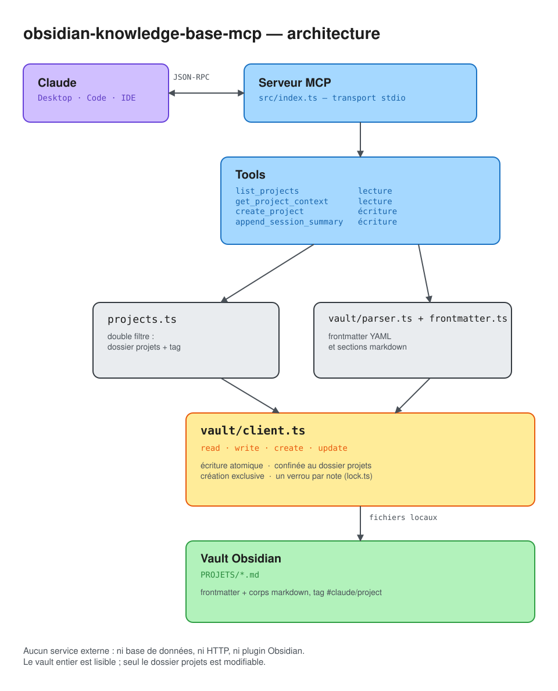

# 🧠 obsidian-knowledge-base-mcp

Serveur MCP qui donne à Claude la mémoire de vos projets, à partir d'un vault
Obsidian.

À chaque nouvelle conversation, Claude retrouve où en est un projet — décisions
prises, architecture actuelle, problèmes ouverts, prochaine étape — sans que
vous ayez à le réexpliquer. En fin de session, il écrit lui-même le bilan dans
la note. Vous ne tapez rien : la base de connaissance reste du markdown que vous
lisez et modifiez normalement dans Obsidian.

## 🔖 Principe

Une note projet est un fichier `.md` ordinaire. Deux conditions pour qu'elle
soit suivie :

1. elle se trouve dans le dossier projets (`PROJETS` par défaut) ;
2. son frontmatter porte le tag `claude/project`.

Le double filtre laisse la décision à l'utilisateur : une note rangée au bon
endroit mais non taguée reste invisible pour le serveur.

Le tag est un tag Obsidian, pas une clé maison. Il participe donc à la
recherche, au graphe, à Dataview et au volet Tags, et se pose depuis l'interface
sans éditer de YAML.

Le frontmatter porte l'état courant du projet — c'est lui que le serveur lit
pour dresser la liste des projets sans ouvrir une seule note :

```yaml
---
title: "Serre connectée"
status: "en cours"
created: 2026-09-01
last_session: 2026-09-08
tags: [claude/project]
progress: "45%"
current_phase: "Phase 2 — Prototype"
next_step: "Mesurer la consommation sur une semaine"
summary: "Arrosage automatique du potager, piloté par capteurs."
stack: [ESP32, LoRa]
open_issues:
  - Autonomie inconnue au-delà de 3 jours
resolved_issues:
  - Étanchéité du boîtier
session_count: 2
---
```

Le corps suit un template en cinq sections : Vision, Décisions validées,
Architecture / Design actuel, Journal des sessions, Questions ouvertes. Voir
[`templates/project-template.md`](templates/project-template.md).

## 🏗️ Architecture



Le schéma est aussi fourni en source modifiable :
[`docs/architecture.excalidraw`](docs/architecture.excalidraw), à ouvrir sur
[excalidraw.com](https://excalidraw.com) ou dans le plugin Excalidraw d'Obsidian.

Accès direct au système de fichiers, pas de plugin ni de serveur HTTP à faire
tourner : Obsidian n'a même pas besoin d'être ouvert. `VaultClient` est
néanmoins une interface étroite, pour qu'une implémentation sur le plugin
[Local REST API](https://github.com/coddingtonbear/obsidian-local-rest-api)
puisse être ajoutée sans toucher aux tools.

```
src/
├── index.ts              Point d'entrée MCP (transport stdio)
├── config.ts             Configuration lue dans l'environnement
├── projects.ts           Chargement et filtrage des notes projet
├── types.ts              Types partagés et titres de sections
├── tools/                Un fichier par tool MCP
└── vault/
    ├── client.ts         Accès fichiers : lecture, écriture atomique, verrou
    ├── parser.ts         Frontmatter YAML et sections markdown
    ├── frontmatter.ts    Écriture des champs sans casser le style existant
    └── lock.ts           File d'attente par note
```

Quatre garanties portent le reste :

- **Rien n'est jamais supprimé.** Le client n'expose aucune méthode de
  suppression. Un problème ne quitte `open_issues` qu'en étant explicitement
  déclaré résolu, jamais par omission.
- **Le corps markdown n'est pas régénéré.** Les écritures n'insèrent qu'aux
  points calculés par le parser ; le reste du fichier est recopié tel quel. Vos
  tableaux, blocs de code et callouts survivent.
- **Le frontmatter garde son style.** Commentaires YAML, ordre des clés,
  guillemets, listes inline et clés hors schéma sont préservés. Une note relue
  puis réécrite sans modification est identique octet pour octet.
- **Les écritures sont atomiques et sérialisées.** Publication par `rename`,
  donc une note ouverte dans Obsidian n'est jamais vue à moitié écrite. Une
  création échoue si la note existe déjà, contrôle fait par le noyau. Deux
  mises à jour d'une même note ne se chevauchent pas.

Les écritures sont en outre confinées au dossier projets : le reste du vault est
lisible, jamais modifiable.

## ⚙️ Installation

Prérequis : Node 20 ou plus, et pnpm.

```bash
pnpm install
pnpm build
```

### Enregistrer le serveur

Avec le CLI Claude Code :

```bash
claude mcp add obsidian-projets -s user \
  --env VAULT_PATH=/chemin/vers/votre/vault \
  -- node /chemin/vers/obsidian-knowledge-base-mcp/dist/index.js
```

Ou dans `claude_desktop_config.json` :

```json
{
  "mcpServers": {
    "obsidian-projets": {
      "command": "node",
      "args": ["/chemin/vers/obsidian-knowledge-base-mcp/dist/index.js"],
      "env": {
        "VAULT_PATH": "/chemin/vers/votre/vault"
      }
    }
  }
}
```

### Variables d'environnement

| Variable                | Défaut           | Rôle                                      |
| ----------------------- | ---------------- | ----------------------------------------- |
| `VAULT_PATH`            | — (obligatoire)  | Chemin absolu du vault Obsidian           |
| `VAULT_PROJECTS_FOLDER` | `PROJETS`        | Dossier des notes projet, relatif au vault |
| `CLAUDE_PROJECT_TAG`    | `claude/project` | Tag qui marque une note comme suivie      |

### Premier projet

Deux façons de démarrer : demander à Claude de créer le projet, ou ajouter
`claude/project` aux tags d'une note existante depuis Obsidian. Dans les deux
cas, elle sera suivie dès la conversation suivante.

Un vault d'exemple est fourni dans `test-vault/` pour essayer sans toucher à vos
notes.

## 📋 Cheatsheet

### Tools

| Tool                     | Accès    | Rôle                                                     |
| ------------------------ | -------- | -------------------------------------------------------- |
| `list_projects`          | lecture  | Tous les projets suivis, du plus récent au plus ancien   |
| `get_project_context`    | lecture  | État d'un projet : frontmatter et sections, sans le journal |
| `create_project`         | écriture | Nouvelle note à partir du template                       |
| `append_session_summary` | écriture | Bilan de session : frontmatter, journal, décisions, questions |

`get_project_context` accepte un titre approximatif dès 3 caractères,
insensible à la casse et aux accents. En dessous, seule l'égalité exacte joue.

### Ce qu'écrit `append_session_summary`

| Champ fourni      | Destination                                              |
| ----------------- | -------------------------------------------------------- |
| `discussed`       | Nouvelle entrée du journal, numérotée et datée           |
| `new_decisions`   | Section Décisions validées, préfixées de la date         |
| `open_questions`  | Section Questions ouvertes                               |
| `open_issues`     | Frontmatter `open_issues`, ajoutés aux problèmes connus  |
| `resolved_issues` | Déplacés de `open_issues` vers `resolved_issues`         |
| `next_step`       | Frontmatter, remplace la valeur précédente               |
| `progress`        | Frontmatter, inchangé si absent                          |
| `current_phase`   | Frontmatter, inchangé si absent                          |

`session_count` est incrémenté à chaque appel, et `last_session` mis à la date
du bilan.

Les problèmes (`open_issues`) et les questions de conception
(`open_questions`) sont volontairement distincts : les premiers vivent dans le
frontmatter, où ils restent visibles dans le volet Propriétés ; les secondes
dans le corps de la note.

Les doublons sont ignorés, à la casse, aux espaces et au préfixe de date près :
une décision déjà prise n'est jamais réécrite.

### Scripts

| Commande     | Effet                                     |
| ------------ | ----------------------------------------- |
| `pnpm build` | Compile vers `dist/`                      |
| `pnpm dev`   | Compile en continu                        |
| `pnpm check` | Vérifie les types sans produire de sortie |
| `pnpm test`  | Compile puis lance la suite de tests      |
| `pnpm start` | Lance le serveur (nécessite `VAULT_PATH`) |

Après toute modification du code, relancez `pnpm build` puis redémarrez la
conversation : le serveur tourne depuis `dist/`.

## ⚖️ Licence

Apache-2.0
